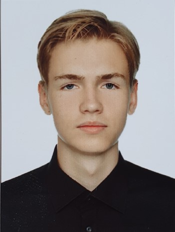
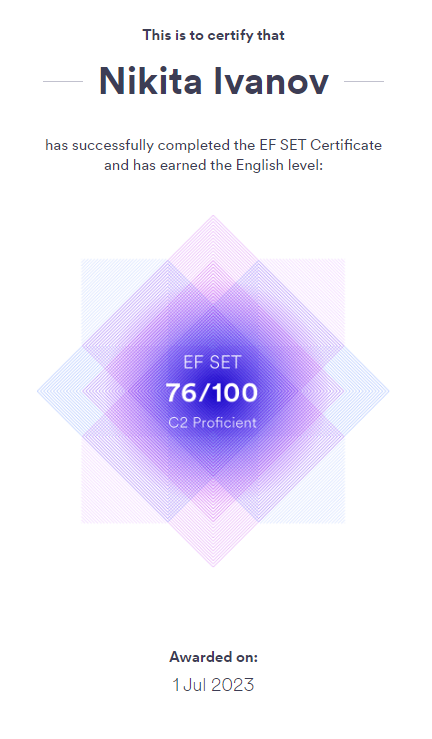

# Nikita Ivanov
### Telegram: [@gerpot](https://t.me/gerpot)
### Discord: [Hukuta02](https://discordapp.com/users/382939522083848202)

## About
__Bornplace: *Vitebsk, Belarus*__

__Age: *19*__

I am *PSU* student now. Studying geodesy and want to try something new. Want to find job that will be complicatable with university studies. And in future I want to have some kind of chose __where and what__ I want to be. Like stay in my origin country or leave it. As soon as i want to be independent i chosen to study programming. I'm interested in it and ready to spend my free time on it.

## Skills

English level: [__C2__](https://www.efset.org/cert/Pt2fAF) by [EFSET.org](https://www.efset.org/)

__Computer literacy__

## Education

__Graduated: *high school degree, Gymnasium №2, Vitebsk*__

__Studying: *Geodesy, Polotsk State University, Novopolotsk*__

## Language

__English, Russian, *minor* Belarussian;__
